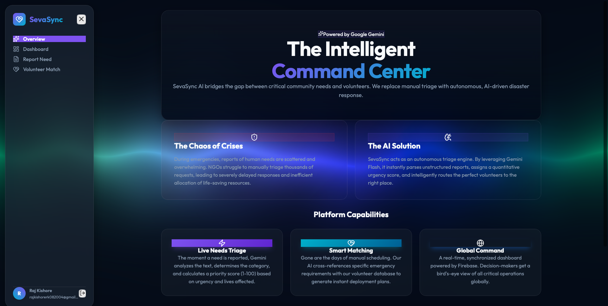

<div align="center">
  
  <br>
  <h1>SevaSync AI</h1>
  <p><b>An Autonomous, AI-Driven Disaster Triage & Volunteer Matching Platform</b></p>
  <p><i>Built for the Google Solution Challenge 2026</i></p>
  
  [](https://sevasync-ai-powered-help.web.app)
  <br><br>
  <a href="https://sevasync-ai-powered-help.web.app"><strong>🚀 View Live Platform Demo</strong></a>
</div>

<br>

<div align="center">
  <!-- Platform Dashboard Screenshot -->
  
  <p><i>Platform Interface Overview</i></p>
</div>

<br>

## 🌍 The Problem

During natural disasters, crises, or in underserved communities, data regarding immediate human needs is overwhelmingly scattered and unstructured. NGOs and emergency responders struggle to manually triage thousands of incoming reports, leading to severely delayed responses and inefficient allocation of life-saving resources. When every second counts, manual data processing costs lives.

## 💡 The Solution

**SevaSync AI** acts as an autonomous command center. It bridges the gap between critical community needs and the volunteers ready to help. By leveraging state-of-the-art Google AI, SevaSync replaces manual triage with instant, intelligent, and automated disaster response.

---

## 🚀 Google Technologies Under the Hood

SevaSync AI was purposefully engineered utilizing the Google ecosystem to ensure scale, speed, and intelligence.

### 🧠 Google Gemini API (Gemini 2.5 Flash)
- **Live Needs Triage**: The moment a community need is reported in plain, unstructured text, the Gemini SDK instantly parses the context, categorizes the emergency, and assigns a strict **Priority Score (1-100)** based on urgency and lives affected.
- **Smart Volunteer Matching**: Gemini cross-references the specific skills required for an emergency (e.g., medical expertise, structural repair) with our live database of volunteers to generate instant deployment plans.
- **Structured JSON Schemas**: We utilize Gemini's strict `responseSchema` capabilities to ensure the AI's output is perfectly structured for our database, eliminating hallucinations and parsing errors.

### 🔥 Firebase Ecosystem
- **Firestore (Real-time Database)**: Acts as our Global Command Center. The moment Gemini analyzes a need, it is pushed to Firestore, which instantly synchronizes across all active dashboards globally via `onSnapshot` listeners.
- **Firebase Authentication**: Secures the platform using **Google Sign-In**. Only authenticated NGOs and administrators can access the Command Center to view sensitive triage data.
- **Firebase Hosting**: The entire React application is deployed on Firebase Hosting for blazing-fast, secure, and globally distributed access.

---

## ✨ Core Features

1. **Interactive Platform Overview**: A stunning glassmorphic walkthrough explaining the platform's social impact to first-time users.
2. **Real-Time Dashboard**: Live metrics tracking open needs, critical emergencies, and active volunteers.
3. **AI Needs Reporting**: A natural language input system where users describe a crisis, and the AI handles the data structuring.
4. **Autonomous Matching**: 1-click intelligent assignment of volunteers to the most critical tasks based on AI reasoning.
5. **Premium UI/UX**: Custom-built CSS glassmorphism, animated auroras (WebGL), and responsive design.

---

## 🛠️ Local Development Setup

To run SevaSync AI locally:

1. **Clone the repository:**
   ```bash
   git clone https://github.com/Rajkishore08/sevasync-ai.git
   cd sevasync-ai
   ```

2. **Install dependencies:**
   ```bash
   npm install
   ```

3. **Configure Environment Variables:**
   You need a Google Gemini API Key. Create a `.env` file in the root directory:
   ```env
   VITE_GEMINI_API_KEY=your_gemini_api_key_here
   ```

4. **Run the development server:**
   ```bash
   npm run dev
   ```

## 🔗 Deployment

This application is continuously deployed to Firebase Hosting. 
You can access the live production build at: **[https://sevasync-ai-powered-help.web.app](https://sevasync-ai-powered-help.web.app)**

## 👥 Impact

By utilizing Google's Gemini AI to automate the triage process, SevaSync AI reduces response formulation times from hours to milliseconds. This ensures that in the wake of a disaster, aid is dispatched intelligently, efficiently, and to the people who need it most.
